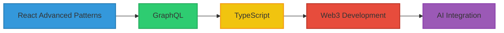

<div align="center">
  
  <!-- Custom SVG Header with Animation -->
  
  
  <br>
  
  <!-- Animated Badge Section -->
  <a href="https://www.linkedin.com/in/clintongilly/">
    
  </a>
  <a href="mailto:clinton.gilly@example.com">
    
  </a>
  <a href="https://twitter.com/clintongilly">
    
  </a>
  <a href="https://clinton-gilly.dev">
    
  </a>
  
  <!-- Profile Views Counter -->
  
  
</div>

<br>

<!-- Animated Wave Separator -->


##  About Me

```js
// src/clinton.js

class Developer {
  constructor() {
    this.name = 'Clinton Gilly';
    this.role = 'Full-Stack Developer';
    this.languages = ['JavaScript', 'HTML', 'CSS', 'Node.js'];
    this.tools = ['React', 'Express', 'MongoDB', 'Git'];
    this.architectures = ['MVC', 'REST', 'SPA'];
    this.challenge = 'Currently building a platform that helps developers showcase their work';
  }
  
  sayHi() {
    return `Thanks for stopping by! Let's build something amazing together.`;
  }
}

const clinton = new Developer();
console.log(clinton.sayHi());
```

<p align="center">
  <a href="https://github.com/Clinton-Gilly/github-readme-streak-stats">
    
  </a>
</p>

---

## 💻 My Tech Universe

<div align="center">

<table>
  <tr>
    <td valign="top" width="33%">
      <h3 align="center">Frontend</h3>
      <div align="center">  
        <a href="https://reactjs.org/" target="_blank"></a>  
        <a href="https://en.wikipedia.org/wiki/HTML5" target="_blank"></a>  
        <a href="https://www.w3schools.com/css/" target="_blank"></a>  
        <a href="https://www.javascript.com/" target="_blank"></a>  
      </div>
    </td>
    <td valign="top" width="33%">
      <h3 align="center">Backend</h3>
      <div align="center">  
        <a href="https://nodejs.org/" target="_blank"></a>  
        <a href="https://expressjs.com/" target="_blank"></a>  
        <a href="https://www.mongodb.com/" target="_blank"></a>  
      </div>
    </td>
    <td valign="top" width="33%">
      <h3 align="center">Tools & DevOps</h3>
      <div align="center">  
        <a href="https://github.com/" target="_blank"></a>  
        <a href="https://www.gnu.org/software/bash/" target="_blank"></a>  
        <a href="https://www.docker.com/" target="_blank"></a>  
      </div>
    </td>
  </tr>
</table>

</div>

---

## 📊 My GitHub Stats

<div align="center">
  <a href="https://github.com/Clinton-Gilly/">
    
    
  </a>
</div>

<!-- Activity Graph -->
<p align="center">
  <a href="https://github.com/Clinton-Gilly/github-readme-activity-graph">
    
  </a>
</p>

---

## 🌟 Featured Projects

<div align="center">
<a href="https://github.com/Clinton-Gilly/project-1">
  
</a>
<a href="https://github.com/Clinton-Gilly/project-2">
  
</a>
</div>

---

## 🌱 Current Learning Path

<div align="center">



</div>

---

## 💪 Professional Skill Level

<div align="center">
  
  **Frontend Development**
  
  
  **Backend Development**
  
  
  **Database Design**
  
  
  **Problem Solving**
  
  
  **UI/UX Design**
  
  
</div>

---

## 📫 Let's Connect

<div align="center">
  <p>I'm always interested in collaborating on exciting projects or just chatting about web development!</p>
  
  <a href="mailto:clinton.gilly@example.com">
    
  </a>
  <a href="https://www.linkedin.com/in/clintongilly/">
    
  </a>
  <a href="https://twitter.com/clintongilly">
    
  </a>
</div>

<!-- Footer Separator -->


<div align="center">
  
  ### "The only way to do great work is to love what you do." - Steve Jobs
  
  ⭐️ From [Clinton-Gilly](https://github.com/Clinton-Gilly) with ❤️
  
</div>
